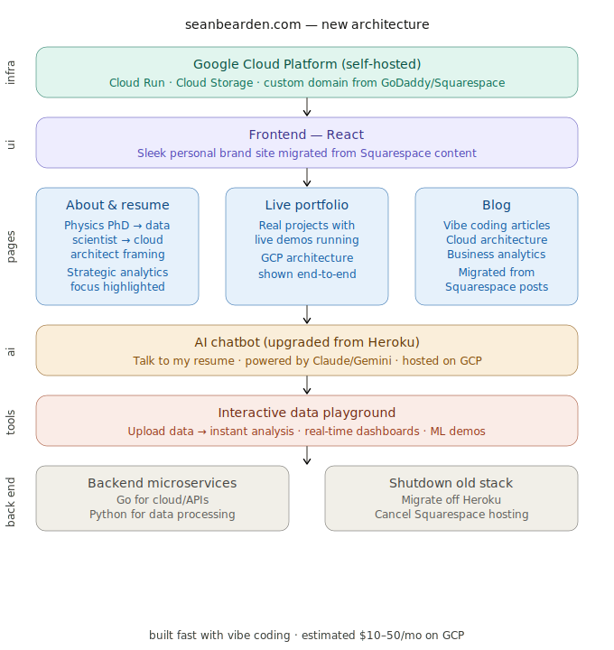

# Sean Bearden — Portfolio Website

[](https://codecov.io/gh/seanbearden/portfolio)

Live at **[seanbearden.com](https://seanbearden.com)** — also serving on `www.seanbearden.com`.

Personal portfolio website for Sean Bearden, Ph.D. — self-hosted on Google Cloud, migrated from Squarespace.

## Architecture



## Coverage

[](https://codecov.io/gh/seanbearden/portfolio)

The inner ring is `frontend/`; outer rings are subdirectories and files. Color = covered (green) vs uncovered (red).

**Stack:** React 19 + Vite + TypeScript + Shadcn/ui + Tailwind CSS, served by nginx on Cloud Run.

**Infrastructure:** Terraform-managed GCP (Cloud Run, Cloud Storage, Artifact Registry, Workload Identity Federation). Estimated $2–5/mo for Phase 1.

## Phases

| Phase | Description | Status |
|-------|-------------|--------|
| **1. Portfolio Site** | Static site with blog, portfolio, publications, about | Live |
| **2. Resume Chatbot** | "Talk to my resume" powered by Claude/Gemini | Planned |
| **3. Data Playground** | Upload data → instant analysis, dashboards, ML demos | Planned |

## Development

```bash
cd frontend
npm install
npm run dev       # localhost:5173
npm run build     # typecheck + production build
```

## Release Flow

```
Feature PR (add changeset via `cd frontend && npx changeset`)
  → merge to main
    → Release action opens "Version Packages" PR
      → merge → creates v* tag → Deploy action → Cloud Run
```

Manual deploy: `gh workflow run deploy`

## Project Structure

```
content/                  # Blog posts (.md), portfolio (.md), home/publications (.json)
frontend/                 # React SPA (Vite + Shadcn/ui + Tailwind)
infrastructure/           # Terraform for GCP resources
scripts/                  # Content conversion + asset upload
site-data/                # Original Squarespace extraction (reference)
.changeset/               # Release management config
.github/workflows/        # CI, Release, Deploy pipelines
```

## Content

- **8** portfolio projects (data science, physics research, AI)
- **25** blog posts (2018–2024)
- **6** peer-reviewed publications (Nature, Europhysics Letters, Physical Review Applied, Applied Physics Letters)
- **37** images + **5** PDFs hosted on Cloud Storage

## Migration Notes

- DNS cutover from Squarespace to Cloud Run completed 2026-05-03. Apex (`seanbearden.com`), `www`, and a `beta` staging subdomain all serve from the same Cloud Run service via Google-managed certs.
- Resume chatbot (`bearden-resume-chatbot.com`, on Heroku) migrating to this app in Phase 2.
- Old Squarespace URLs redirect automatically via React Router (`frontend/src/utils/redirects.ts`).
